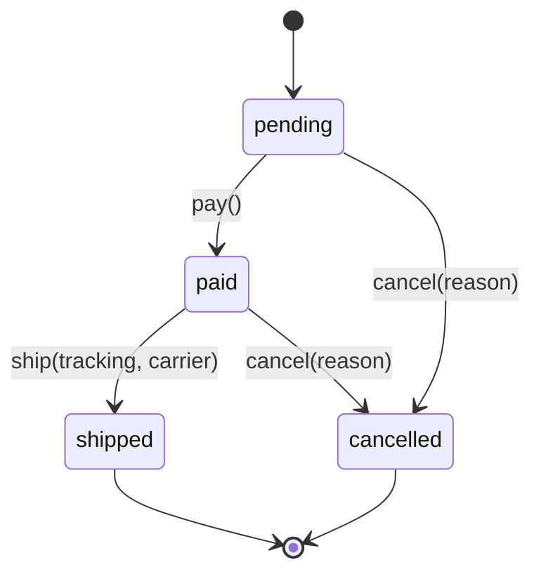

# Diagramming

## Overview

The failure mode is prose walls where a picture wins: 100+ lines describing a 4-state machine that a 10-line diagram shows at a glance. For structure and time, the diagram comes FIRST and prose annotates — not the reverse.

## Trigger table — this content gets a diagram

| Content | Diagram | Why prose/tables lose |
|---|---|---|
| State machine / lifecycle | `stateDiagram-v2` | Reader must see the SHAPE: terminal states, cycles, dead ends, legal-vs-illegal paths at a glance |
| Temporal interaction, 2+ components | `sequenceDiagram` | Ordering and ownership of each step |
| Request/data flow with branches (errors, retries) | `flowchart TD` | Branch points vanish in prose |
| Topology / dependencies, >3 nodes | `flowchart` / `graph` | Relationships are 2-D; prose is 1-D |

NOT a diagram: ≤3 nodes, a single linear list, short enumerable facts (per-state fields, file responsibilities — tables win), anything the reader consumes as a lookup.

## Example (the whole point in 9 lines)



Terminal states, the no-path-back-from-shipped rule, and both cancel edges are now visible — the table of transition functions supplements this, it cannot replace it.

## Conventions

- **One concern per diagram.** Lifecycle and request-path are two diagrams, not one mega-graph. (Hosted renderers also hard-cap size — split, don't shrink.)
- **Names match the code** — states/participants use the identifiers from the source (`pending`, `fetchOrder`), so grep works from the diagram.
- **Diagram lives next to the doc**: fenced ```` ```mermaid ```` block in the same markdown file, versioned with the code it explains.
- **No explicit `theme` in `%%{init}%%`** for committed diagrams — it overrides the platform's light/dark adaptation and produces unreadable dark-on-dark.
- **Stick to core types where they must render** (state, sequence, flowchart, class): GitHub pins an older Mermaid than upstream docs describe; new/beta types (including Mermaid C4) can silently fail to render. Verify rendering before relying on anything exotic.

## Red flags

| Flag | Fix |
|---|---|
| Paragraphs enumerating transitions/steps | That's a diagram announcing itself |
| A diagram restating a 3-item list | Delete it — decorative |
| One diagram carrying two concerns | Split |
| Hand-positioned/GUI diagram for code-adjacent docs | Text-based (mermaid) so it diffs and versions |

Tool status facts (Mermaid/GitHub version lag, D2, PlantUML, Structurizr for C4): see [references/ecosystem.md](references/ecosystem.md).
